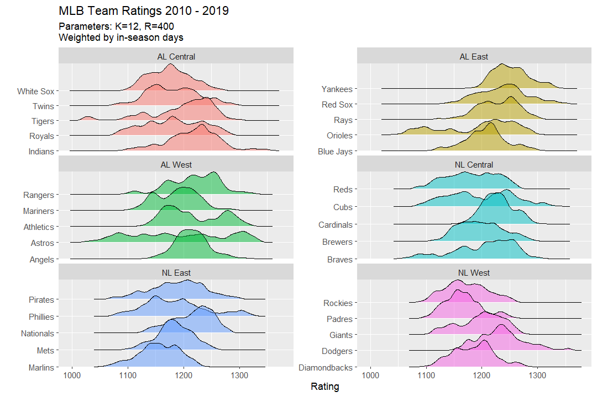
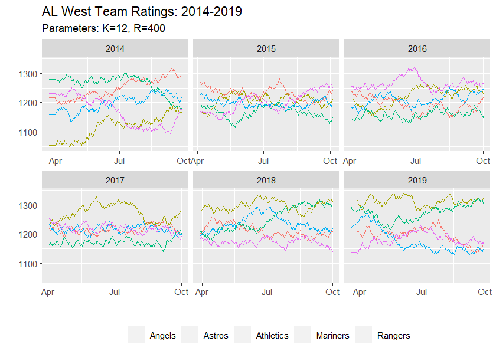

## Overview

## Data

Source data: https://www.retrosheet.org/gamelogs/index.html

The only stipulation for use of this data is prominent display of this statement:

>The information used here was obtained free of 
>charge from and is copyrighted by Retrosheet.  Interested
>parties may contact Retrosheet at "www.retrosheet.org".

## Examples

