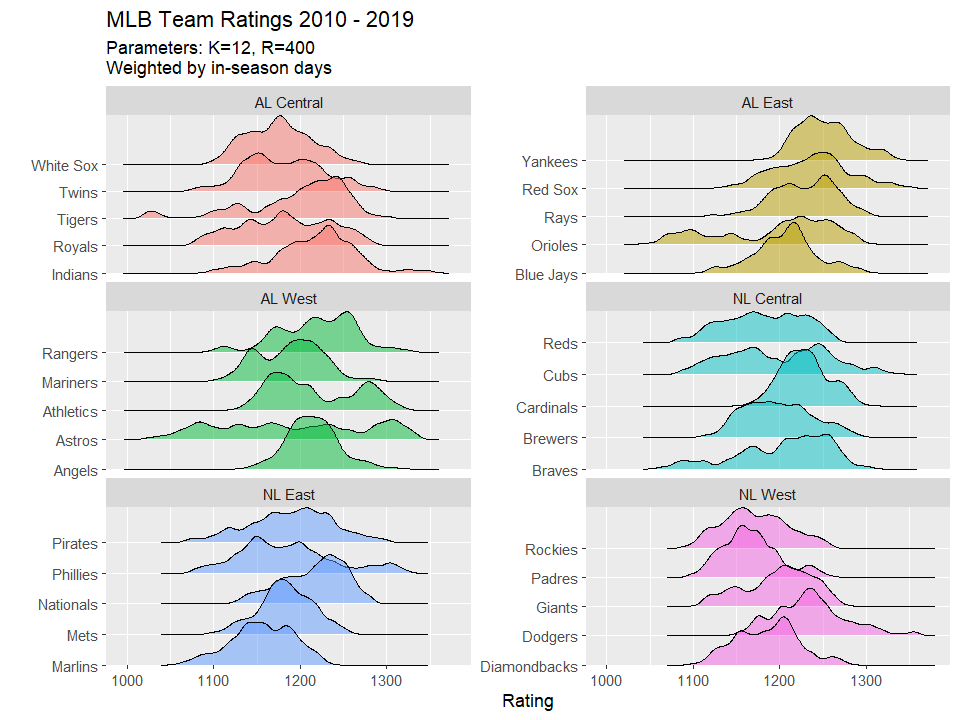

## Overview

This project uses historical baseball games data to calculate an Elo-like rating for MLB teams based on regular season match ups. The Elo rating system was originally developed for ranking chess players but also can 

Wikipedia has more technical details on the rating system:
https://en.m.wikipedia.org/wiki/Elo_rating_system

A similar analysis was done by 538:
https://projects.fivethirtyeight.com/complete-history-of-mlb/

This repo consists of three primary pieces of code:
* `Parser.py` imports and cleans the game-level data. It performs basic calculations, such as determining game winners.
* `Elo.py` calculates Elo ratings for a given set of games data
* `Visualization.R` plots the output in a variety of interesting ways

## Data

Source: https://www.retrosheet.org/gamelogs/index.html

This data was compiled by Retosheet.org. The only stipulation for use of this data is prominent display of this statement:

>The information used here was obtained free of 
>charge from and is copyrighted by Retrosheet.  Interested
>parties may contact Retrosheet at "www.retrosheet.org".

The formats of the data can be found in the `Formats.py` module.
 
## Examples

This graph shows the distribution of each team's Elo rating over the course of the decade 2010-2019. The ratings are weighted by in-season days.

This graph shows the progress of the 5 teams in the AL West over the 5-year period starting in 2014.

Each team was also ranked by their Elo relative to the rest of the league on each day. The graph below shows the time spent at each rating for the 5 teams in the AL West.

## Future improvements 

* Finish tuning parameters for best model performance
* Expand analysis to earlier time periods (requires handling of teams entering/leaving league)
